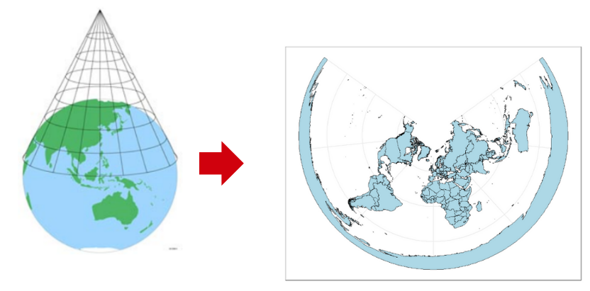

background-image: url("presentation_images/Talk_flyer.png")
background-size: cover
class: right, bottom, inverse

```{r setup, include=FALSE}
options(htmltools.dir.version = FALSE)
```


---
class: inverse, center, middle

# Why use R for Spatial Visualisations?

---
class:  left, top


**1. Rich Ecosystem of Spatial Packages**

R packages designed specifically for spatial data handling:

- _sp_ - provides a more traditional approach for handling point data
- _sf (simple features)_ - modern successor for handling point data, facilitates integration with _tidyverse_ workflows
- _raster_ - historic package used for handling raster data     
- _terra_ - modern successor used for handling raster data

Additionally, R integrates well with specialized mapping tools such as:

- _ggplot2_
- _plotly_
- _tmap_ 
- _leaflet_


**2. Integration with Data Manipulation and Analysis**

R's ability to preprocess and manipulate spatial data using tools such as:

- _dplyr_
- _tidyr_


---
class:  left, top

**3. Interactivity and Web Integration**

R offers the ability to create interactive spatial visualizations with packages such as : 

- _shiny_

Dynamic, web-ready visualizations, capable of enhancing the user experience and broadening the scope for spatial data presentations is made possible with tools such as:

- _leaflet_
- _plotly_


- **4. Reproducibility and Documentation**


R users can document their entire spatial analysis process—from data import to visualization—within the same environment, ensuring that others can replicate and validate the analysis, this is made possible with tools such as:

- _RMarkdown_
- _knitr_


---
class: inverse, center, bottom


background-image: url("presentation_images/img0.png")
background-position: 50% 50%
class: center, top, inverse


## What are the basic Geometric types in Spatial data Visualizations ?

---

In the context of spatial data, there are three fundamental geometric types: 

1) **Points**

- The simplest geometric type, representing discrete locations on the Earth's surface. They are defined by a single pair of coordinates (e.g., latitude and longitude).

- Furthermore, points are used for features that have no area or length, such as cities, landmarks, trees, or any other precise location-based data. 

<br>

2) **Lines (or LineStrings)**
- Sequences of points connected in order, forming a path. They represent features that have length but no area, capturing the linear dimension of spatial data.

- Lines are used to model linear features such as roads, rivers, railways, or power lines.


---

3) **Polygons**

- Are closed shapes defined by a series of connected lines (or points) that form a boundary, representing areas on the Earth's surface.

- Polygons are used to represent features that have an area, such as countries, lakes, land , or building footprints.


.pull-left[

```{r, echo=FALSE, fig.height=20, out.width='90%', fig.align='center'}

```

]

```{r, echo=FALSE, fig.height=20, out.width='50%', fig.align='center'}

```


---
class: inverse, center, middle

# What are the types of Data for Spatial Visualizations in  R ?

---
class:  left, top


**1. Vector/Point Data**

Represents individual geographic locations defined by latitude and longitude coordinates, often used to model discrete events or features like cities, weather stations, or specific observations. This type of data is handled using packages like **`sf`** or **`sp`**.


**2. Raster Data**

Represents spatial data in a grid format, where each cell in the grid holds a value corresponding to a specific geographic area. It is commonly used for continuous data, such as elevation, temperature, or land cover, and can handle large datasets efficiently. In R, packages like **`raster`** and **`terra`** are used to manage, analyze, and visualize raster data.

--

.pull-left[

```{r, echo=FALSE, fig.height=20, out.width='90%', fig.align='center'}

```

]

--

.pull-right[

```{r, echo=FALSE, fig.height=20, out.width='90%', fig.align='center'}

```

]

--

.pull-left[

```{r, echo=FALSE, fig.height=20, out.width='90%', fig.align='center'}

```
 
 ]


---
class: inverse, center, middle

# Different ways of Projecting Maps

---
class: left, top

Map projections are classified into three main types based on the mathematical transformations used to represent the Earth's spherical surface on a flat, two-dimensional map.

--

.pull-left[
- Cylindrical Projections:

```{r, echo=FALSE, fig.height=50, fig.width=25, fig.align='center'}
knitr::include_graphics("presentation_images/img1.png")
```

]

--

.pull-right[

- Planar projections:


```{r, echo=FALSE, fig.height=30, fig.width=20, fig.align='center'}

```

]

--


.pull-left[

- Conical projections:

```{r, echo=FALSE, fig.height=20, fig.width=20, fig.align='center'}

```

]

???


.pull-right[
<br>
.left[
**nifty**
]
Install the **xaringan** package from [Github](https://github.com/yihui/xaringan):

---
class: inverse, center, middle


background-image: url("presentation_images/img8.png")
background-position: 50% 50%
class: center, top, inverse

# Coordinate Reference Systems (CRS)?


---

## What is a Coordinate Reference System (CRS)?

A Coordinate Reference System (CRS) is a framework that defines how spatial data from the Earth's curved, three-dimensional surface is projected onto a two-dimensional map. 

## Types of CRS : 

1) **Geographic CRS:** - uses a three-dimensional spherical surface to define locations on Earth, typically through latitude and longitude coordinates. Exactly  specifies the position of data on the Earth's surface.
Ex : WGS84 (World Geodetic System 1984)

2) **Projected CRS:** - translates the Earth's curved surface onto a flat plane using mathematical projections, enabling accurate mapping of distances, angles, and areas within specific regions.
Ex : UTM (Universal Transverse Mercator) Web Mercator (EPSG:3857) 

---

As shown in the figure below, the GCS is spherical and records locations in angular units (usually degrees), whereas the PCS is flat and records locations in linear units (usually meters).

<br>

```{r, echo=FALSE, out.width='50%', fig.align='center'}

```

---

Choosing the appropriate CRS is crucial for accurate spatial data visualization and analysis, as it directly impacts the representation of distances, angles, and areas on maps.

<br>

```{r, echo=FALSE, out.width='80%', fig.align='center'}
knitr::include_graphics("presentation_images/img6.png")
```

---

## Components of a CRS :

- **Coordinate System:** - Defines the method for specifying positions, typically using a set of axes (e.g., X and Y for 2D, or X, Y, and Z for 3D) to measure locations in space.

- **Horizontal and Vertical Units:** - Specify the units of measurement (e.g., meters, feet, degrees) for the coordinate values, determining how distances and elevations are represented.

- **Datum:** - Provides a reference point or model of the Earth’s shape, such as a spheroid, to which the coordinate system is anchored, ensuring accuracy in location measurements.

- **Projection Information:** -  Describes the mathematical transformation used to convert the Earth's three-dimensional surface onto a two-dimensional map, affecting how spatial features are represented.


---
class: inverse, center, middle


background-image: url("presentation_images/img7.png")
background-position: 50% 50%
class: center, middle, inverse

# Shapefiles

---
## Shapefiles: An Overview

A shapefile is a popular file format for storing spatial data, widely used in Geographic Information Systems (GIS). It consists of multiple files that together describe geographic features such as points, lines, and polygons.

## Components of a Shapefile

A shapefile consists of several files with the same base name but different extensions, each serving a specific role:

- **`.shp`:** Contains the geometry of the features (e.g., points, lines, polygons).
- **`.shx`:** An index file that provides fast access to the geometry data.
- **`.dbf`:** Stores attribute data in a dBASE table format, linking each shape to descriptive information.
- **`.prj`:** Describes the Coordinate Reference System (CRS), defining how the spatial data is projected on a map.

---
class: inverse, center, middle

# Exploring **`sf`** library package

---
class: inverse, center, middle


background-image: url("presentation_images/sf.png")
background-position: 50% 50%
class: center, middle, inverse

---

## Introduction to the sf Package in R

The **`sf`** (simple features) package is a modern and efficient library for handling spatial data in R, providing a user-friendly and consistent approach to working with geographic information. It uses simple feature standards, where spatial data is stored in a data frame-like structure with a special geometry column, making it easy to integrate spatial data with data manipulation tools from the tidyverse.


## Key Functions of the sf Package

- **`st_read()`:** Reads shapefiles and other spatial data formats, allowing users to import spatial data into R as sf objects.

- **`st_geometry()`:** Inspects the geometry of spatial data, revealing how geographic features are represented (e.g., points, lines, polygons).

- **`st_attributes()`:** Views the attributes or non-spatial data associated with spatial features, such as names, categories, or numerical values.

- **`st_layers()`:** Lists available layers in a spatial data source, useful when working with multi-layer datasets like raster data.


---

## Cont. Key Functions of the sf Package

- **`st_as_sf()`:** Converts data frames or other spatial formats into sf objects, enabling them to be used within the sf framework.

- **`st_crs()`:** Retrieves the current Coordinate Reference System (CRS) of a spatial object.

- **`st_transform()`:** Changes the CRS of spatial data, allowing for the projection of data into different coordinate systems for accurate mapping and analysis.

- **`coord_sf(crs = …)`:** Specifies the CRS of spatial data when plotting with ggplot2, ensuring that maps are displayed correctly according to the desired projection.

---
class: inverse, center, middle


background-image: url("presentation_images/started.png")
background-position: 50% 50%
class: center, middle, inverse


---

First install the required packages :
```{r, comment=NA, fig.height=10, fig.width=20, message=FALSE, warning=FALSE}
# install.packages("devtools")
# devtools::install_github("thiyangt/ceylon")
# install.packages(c("ggplot2", "sf", "kableExtra"))
```

--

.pull-left[

Load the packages :
```{r, comment=NA, fig.height=10, fig.width=20, message=FALSE, warning=FALSE}

library(ceylon)
library(ggplot2)
library(sf)
library(kableExtra)

data(sf_sl_0)

```

Investigate _sf_sl_0_ simple feature object, which contains geometric data.  
```{r, comment=NA, fig.height=10, fig.width=10, message=FALSE, warning=FALSE, echo=FALSE}

sf_sl_0 %>% 
  kable() 
```


]

--


.pull-right[

Plot the Sri Lankan map.

```{r, comment=NA, fig.height=5, fig.width=5, message=FALSE, warning=FALSE}
ggplot(sf_sl_0) +
  geom_sf(fill='yellow') 

```

]
---

Investigate the **district** simple feature object, which contains geometric data and attribute data. 
```{r, comment=NA, fig.height=7, fig.width=7, message=FALSE, warning=FALSE}
head(district) %>% 
  kable()
```

---
Plot the Sri Lankan map with district data.

```{r, comment=NA, fig.height=7, fig.width=7, message=FALSE, warning=FALSE}
district_map <- ggplot() + geom_sf(data = district) +
                labs(title = "Districts of Sri Lanka")
```

.pull-left[

```{r, comment=NA, fig.height=7, fig.width=7, message=FALSE, warning=FALSE}
district_map 
```

]


---

```{r, comment=NA, fig.height=6, fig.width=6, message=FALSE, warning=FALSE}
library(gridExtra)
data(district)
district_map_fill <- ggplot(district) +
  geom_sf(mapping = aes(fill = DISTRICT ), show.legend = FALSE) +
  labs(title = "Districts of Sri Lanka"); district_map_fill
```

---
class: inverse, center, middle


background-image: url("presentation_images/choropleth.png")
background-position: 30% 30%
class: center, bottom, inverse

## Let's Creating Choropleth Maps !

---

Create a simple data set.

```{r, comment=NA, fig.height=6, fig.width=6, message=FALSE, warning=FALSE}
data <- data.frame(
  Harvested = c(59869, 48111, 10704, 25327, 2448, 8155),
  DISTRICT = c("ANURADHAPURA", "BADULLA", "BATTICALOA", "COLOMBO",
               "JAFFNA", "AMPARA")
                  )

```

---

Using the **district** simple feature object include the geometric and attribute data into the data set.

```{r, comment=NA, fig.height=6, fig.width=6, message=FALSE, warning=FALSE}
library(dplyr) # required for full_join function
production_data <-  district %>% full_join( data, by = "DISTRICT")
head(production_data) %>%
  kable()
```

---


```{r, comment=NA, fig.height=6, fig.width=6, message=FALSE, warning=FALSE}
ggplot(production_data) +
  geom_sf(mapping = aes(fill = Harvested), show.legend = TRUE) +
  geom_sf_text(aes(label = DISTRICT), size = 1.8, color = "white") +
  scale_fill_viridis_c(option = "E") #scale_fill_viridis_d() for discrete data 
# Color map options: "A","B","C","D","E","F","G","H"  
```

---
class: inverse, center, middle


background-image: url("presentation_images/bubble_maps.png")
background-position: 50% 50%
class: center, bottom, inverse
style: color: black;

## Bubble Maps using the _leaflet_ package

---

Let's load the dummy data set:

```{r, comment=NA, message=FALSE, warning=FALSE}
library(readxl)
survey_data <- read_excel("Survey_Sheet.xlsx")
survey_data <- data.frame(survey_data)
head(survey_data) %>%
  kable() %>%
  kable_styling(font_size = 12)
```


This data set shows the different locations visited, as well as the **Rice Variety**, **Stage of maturity**, **Disease incidence**, and **Soil Type** at each of these locations.

---

## Spacially Visualizing the information in the data set  


Five main plots have been created using the **`leaflet`** package:

*   Plot of locations visited.
*   Plot of Disease incidence at each location, where the points at each location are proportional to the Disease incidence.
*   Plot of Disease incidence at each location color-coded with respect to Rice Variety, where the points at each location are proportional to the Disease incidence.
*   Plot of Disease incidence at each location color-coded with respect to Stage of maturity.
*   Plot of Disease incidence at each location color-coded with respect to Soil Type.


---

## Key features of the **`leaflet`** library package in R

-   **_Interactive Maps_** : _leaflet_ enables the creation of maps with interactive elements like markers, popups, polygons, and lines. Users can interact with these elements by clicking, hovering, and zooming, making the maps highly engaging and informative.

-   **_Tile Layers_** : You can overlay different tile layers from various sources (e.g., OpenStreetMap, Mapbox) to provide context to your map. This helps users understand the geographic context of your data. (In this section, a map of Sri Lanka in red has been overlaid on a tiled map using the addTiles() command.)

-   **_Geo-spatial Interaction_** : _leaflet_ supports geospatial interactions such as zooming, making it easy to navigate through maps containing a large amount of data.

---

Load the following packages :
```{r, comment=NA, message=FALSE, warning=FALSE}
library(sf)
library(leaflet)
library(ceylon)
library(tidyverse)
library(dplyr)
library(viridis)
```

    
Manipulating and transforming spatial data using the **`sf`** package. 
```{r, comment=NA, message=FALSE, warning=FALSE}

# Convert your data to a sf object
sf_data <- st_as_sf(survey_data, coords = c("Latitude","Longitude"))

# Set the CRS EPSG 4326 (WGS 84)
st_crs(sf_data) <- 4326 

```


---

```{r, comment=NA, message=FALSE, warning=FALSE}
# Transform sf_data to match the CRS of the district boundaries
# Ensures both data sets use the same CRS
newdata_sf <- st_transform(sf_data, crs = st_crs(district))

# Transform the district boundaries to EPSG 4326 (WGS 84)
district_WGS84 <- st_transform(district, 4326)

# Transform coordinates of newdata_sf to EPSG 4326 (WGS 84)
newdata_sf_WGS84 <- st_transform(newdata_sf, 4326)
```


#### Figure 1: Plot of locations visited


```{r, comment=NA, message=FALSE, warning=FALSE}

Fig1 <- leaflet() %>%
  addPolygons(data = district_WGS84, fillOpacity = 0.2,
              smoothFactor = 0.1, weight = 1, color = "red") %>%
  addCircleMarkers(data = newdata_sf_WGS84, color = "blue",
    popup = ~as.character(District),
                   radius = 1, fillOpacity = 0.7) %>%
  addTiles() #used to add the base map
```

---

```{r,echo=TRUE, eval=FALSE}
Fig1
```


---

#### Figure 2: Plot of Disease incidence at each location


The radius of circular markers is determined by the **Disease_incidence** variable, which is normalized using the **scales::rescale()** function. The values are scaled between a range of **min_radius** and **max_radius**, adjusting the marker size accordingly. 

```{r, comment=NA, message=FALSE, warning=FALSE}
max_radius <- 25  # Set the maximum and minimum radius size
min_radius <- 1   # Set the minimum radius size

# Normalize the "Disease_incidence" variable to the range of radius values
normalized_radius <- scales::rescale(
  newdata_sf_WGS84$Disease_incidence,
  to = c(min_radius, max_radius))
```

```{r, comment=NA, message=FALSE, warning=FALSE}
Fig2 <- leaflet() %>%
  addPolygons(data = district_WGS84, fillOpacity = 0.2,
              smoothFactor = 0.1, weight = 1, #border weight
              color = "red") %>%  #border color
  addCircleMarkers(
    data = newdata_sf_WGS84,
    color = "darkgreen", #Colour of circular markers
    radius = normalized_radius, #use the calculated normalized radius values
    fillOpacity = 0.1, popup = ~as.character(Disease_incidence) #pop up on click
  ) %>% addTiles() #used to add the base map
```

---

```{r,echo=TRUE, eval=FALSE}
Fig2
```


---

#### Figure3: Plot of Disease incidence at each location color-coded with respect to Rice Variety.

```{r, comment=NA, message=FALSE, warning=FALSE}
# Introduce a color palette of 23 for each unique Rice variety
color_palette <- c("#00CCFF", "#FF9900", "#FFC2B5",
                   "#FF00FF", "#286C3B", "#C0717C",
                   "#CBD588", "#5F7FC7", "#FF3300",
                   "#FFFF00", "#9900FF", "#508578",
                   "#00FF33", "#689030", "#AD6F3B",
                   "#CD9BCD", "#D14285", "#6DDE88",
                   "#652926", "#005DFF", "#C84248",
                   "#8569D5", "#5E738F")
```


---

```{r, echo=TRUE, eval=FALSE}
Fig3 <- leaflet() %>%
  addPolygons(data = district_WGS84, fillOpacity = 0.2,
              smoothFactor = 0.1, weight = 1,
              color = "red") %>%
  addCircleMarkers(
    data = newdata_sf_WGS84,
    color = ~color_palette[match(Rice_Variety,
    unique(newdata_sf_WGS84$Rice_Variety))],
    # Use the calculated normalized radius values
    radius = normalized_radius,  
    fillOpacity = 0.3,
    # Add popup labels with the Rice_Variety value
    popup = ~as.character(Rice_Variety)  
  ) %>%
  addTiles() %>%
  addLegend(
    "bottomright",  # You can adjust the position of the legend
    title = "Rice Varieties",
    colors = color_palette,
    labels = unique(newdata_sf_WGS84$Rice_Variety),
    opacity = 1
  )

```


---

```{r,echo=TRUE, eval=FALSE}
Fig3
```

---

####  Figure 4: Plot of Disease incidence at each location color-coded with respect to Stage of maturity.

```{r, comment=NA, message=FALSE, warning=FALSE}
# Introduce a color palette of 4 for each unique Stage of maturity
color_palette <- c("#00CCFF", "red", "#652926","black")
```


```{r, echo=TRUE, eval=FALSE}
Fig4 <- leaflet() %>%
  addPolygons(data = district_WGS84, fillOpacity = 0.2,
              smoothFactor = 0.1, weight = 1, 
              color = "red") %>%
  addCircleMarkers(
    data = newdata_sf_WGS84,
    color = ~color_palette[match(Stage_of_maturity,
      unique(newdata_sf_WGS84$Stage_of_maturity))],
      # Use the calculated normalized radius values
      radius = normalized_radius, 
      fillOpacity = 0.3,
      # Add popup labels with the Stage_of_maturity
      popup = ~as.character(Stage_of_maturity)) %>% 
      addTiles() %>%
      addLegend( "bottomright",  #Adjust the position of the legend
      title = "Stage of maturity", colors = color_palette,
      labels = unique(newdata_sf_WGS84$Stage_of_maturity),
      opacity = 1 )
```


---

```{r,echo=TRUE, eval=FALSE}
Fig4
```

---
####  Figure 5: Plot of Disease incidence at each location color-coded with respect to Soil Type.

```{r, comment=NA, message=FALSE, warning=FALSE}
# Introduce a color palette of 6 colors for each unique Soil type
color_palette <- c("#00CCFF", "#FF00FF", "#FFFF00", "#00FF33",
                   "#652926", "#005DFF")
```


```{r, eval=FALSE,echo=TRUE}
Fig5 <- leaflet() %>%
  addPolygons(data = district_WGS84, fillOpacity = 0.2,
              smoothFactor = 0.1, weight = 1, color = "red") %>%
  addCircleMarkers(
    data = newdata_sf_WGS84,
    color = ~color_palette[match(Soil_Type,
            unique(newdata_sf_WGS84$Soil_Type))],
    radius = normalized_radius, #Calculated normalized radius values
    fillOpacity = 0.3,
    popup = ~as.character(Soil_Type)   ) %>% 
  addTiles() %>%
  addLegend(
    "bottomright",  # Position of the legend
    title = "Soil Type",
    colors = color_palette,
    labels = unique(newdata_sf_WGS84$Soil_Type),
    opacity = 1)

```


---

```{r,echo=TRUE, eval=FALSE}
Fig5
```


---
class: center, middle

# Thanks!

Slides created by **Ishara Wijayaratne**

Reach me through email: ishara.wijayaratne@gmail.com